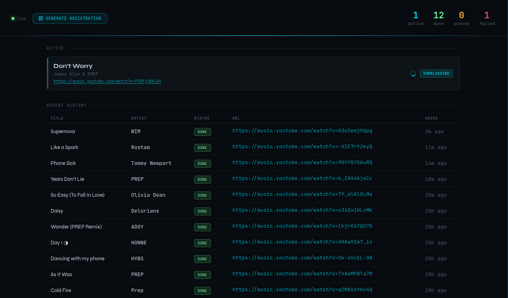
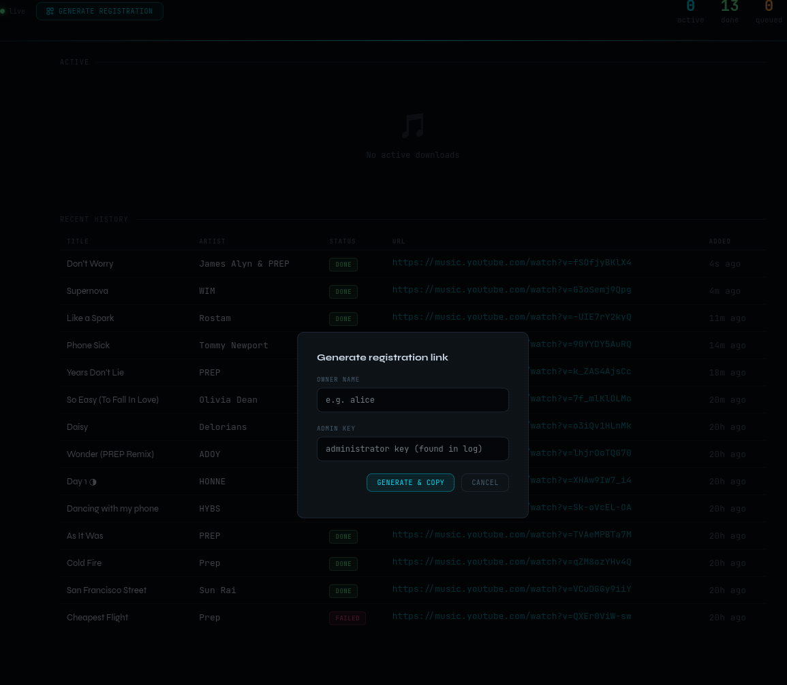

# Yt-dlp Api



This is a very simple project that provides an api for the associated extension. 
In essence it is a wrapper around the `yt-dlp` command line tool, but enables you to record the music you listen to, as you listen to it. 

The extension (https://github.com/NHAS/tracker-extension) built for firefox, loads some JS into the `http://music.youtube.com` to watch the player and record the video id of the current song, sending it off to the api for recording. 


## Warning

This is a personal project. Unlike my other repos such as `reverse_ssh` and `wag` the amount of support and cleaniliness of this project is likely to be minimal. 

Bear that in mind when opening issues and requesting features please. 

## Docker compose

```yml
services:
  ytdl-server:
    image: ghcr.io/nhas/ytdlp-api:latest
    restart: unless-stopped
    ports:
      - "8080:8080"
    volumes:
      - downloads:/downloads
      - data:/data
      - ./config.json:/app/config.json:ro
 
volumes:
  downloads:
  data:
```


## Configuration

This project takes an environment variable `CONFIG_PATH` to determine where its config path is. 
It'll default to `/data/config.json` is none is specified.

| Field | Default | Description |
|---|---|---|
| `addr` | `localhost:8080` | Address and port the HTTP server listens on |
| `external_address` | Same as `addr` if none set | Publicly reachable URL of this server, used when generating extension registration links |
| `downloads_path` | `/downloads` | Directory where downloaded audio files are saved |
| `db_path` | `/data/ytdl.db` | Path to the SQLite database file |
| `download_timeout` | `5m` | Maximum time allowed for a single `yt-dlp` download before it is cancelled |
| `key` | Random and printed to stdout if not set | Admin key required to call `/api/register` and provision new extension API keys |


Example:

```js
{
    "addr": ":8080",
    "external_addr": "example.com",
}
```

## Registration

On the server UI click the `Generate registration` button top left. 
This will require you to have the administrative key which is either configured in `config.json` or random generated on start of this container.




This will then generate a link like the following:
```
ext+ytdl://register?key=2f1fbbbb8460115722218a63c6bf81d1&url=http%3A%2F%2Flocalhost%3A8080
```

Either give this to your user, or browse to it in a browser that has loaded the [extension](https://github.com/NHAS/tracker-extension), this will automatically fill in the details and once you begin listening to music on https://music.youtube.com you should see music starting to be downloaded